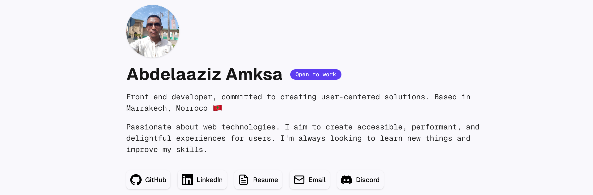

<h1 align="center">Welcome to my Portfolio </h1>

<div align="center">

</div>

## 🧉 About

A developer portfolio designed to showcase projects, experience and skills that I achieved during my career.

## 🚀 Installation

To get started on this project you need to follow the next steps:

```bash
git clone https://github.com/amxsupport/portfolio
# First clone the repo in your folder of choice.
cd portfolio
# Move into the recently cloned repo.
pnpm install
# Install dependencies using pnpm or your preferred package manager.
pnpm dev
# Run the development server of the project.
```

## 💻 Technologies

The project is being developed with the following tech stack:

- Next.js
- TypeScript
- TailwindCSS
- Shadcn/ui
- Resend
- And more

## Author

###### **Gonzalo Parra**

- Website: 
- GitHub: [@amxsupport](https://github.com/amxsupport)
- LinkedIn: [@abdelaaziz.amx](https://www.linkedin.com/in/abdelaaziz-amksa-28689753/)

###### 🤝 Special thanks to [@gonzalojparra](https://github.com/gonzalojparra) for showcasing the main idea!

## Usage

If you'd like to use this project as a template for your site, please give me credit by linking my GitHub profile in your README.md file. Also, make sure to replace all my personal information with yours.
